# Targeted Small RNA-Seq Analysis Report

## Joshua Rivera  Ph.D.
Dana-Farber Cancer Institute / Harvard Medical School 
SOPHiA Genetics Candidate

---

# Introduction

This report presents an exploratory analysis of a targeted small RNA sequencing dataset consisting of three aligned BAM files generated on an Illumina NextSeq platform. The primary objectives were to:

1. evaluate sequencing and alignment quality,
2. identify enriched genes and targeted loci,
3. characterize candidate genetic variants,
4. and investigate the origin and interpretation of large soft-clipped read segments.

Because the dataset derives from targeted small RNA sequencing rather than whole-transcriptome or DNA sequencing, all analyses were interpreted within the context of targeted enrichment, short-fragment alignment behavior, and molecule-aware barcode deduplication.

---

# Dataset Description

The dataset consisted of three hg19-aligned BAM files:

- sample1.bam
- sample2.bam
- sample3.bam

Reads contained embedded 8-mer molecular barcodes stored within the `mb` BAM tag, enabling molecule-aware deduplication and estimation of amplification redundancy.

The sequencing assay represented a targeted enrichment strategy rather than genome-wide sequencing; therefore, coverage was expected to localize strongly to a relatively small subset of genomic regions.

---

# Methods

## Software and Libraries

Analyses were performed using:

- Python
- pysam
- pandas
- numpy
- seaborn
- matplotlib
- samtools
- bcftools
- bwa

Reference resources:

- hg19 reference genome
- GENCODE v19 gene annotations

---

# 1. Alignment-Level Quality Control

## Objectives

The primary QC objective was to evaluate:

- alignment confidence,
- read length structure,
- mapping quality distributions,
- barcode complexity,
- and amplification behavior.

## BAM-Level Inspection

Initial manual inspection of BAM records identified:

- predominantly high-confidence alignments (`MAPQ=255`),
- secondary/multimapping alignments,
- recurrent soft-clipped segments,
- variable read lengths,
- and embedded `mb` molecular barcode annotations.

## Read Length Distributions

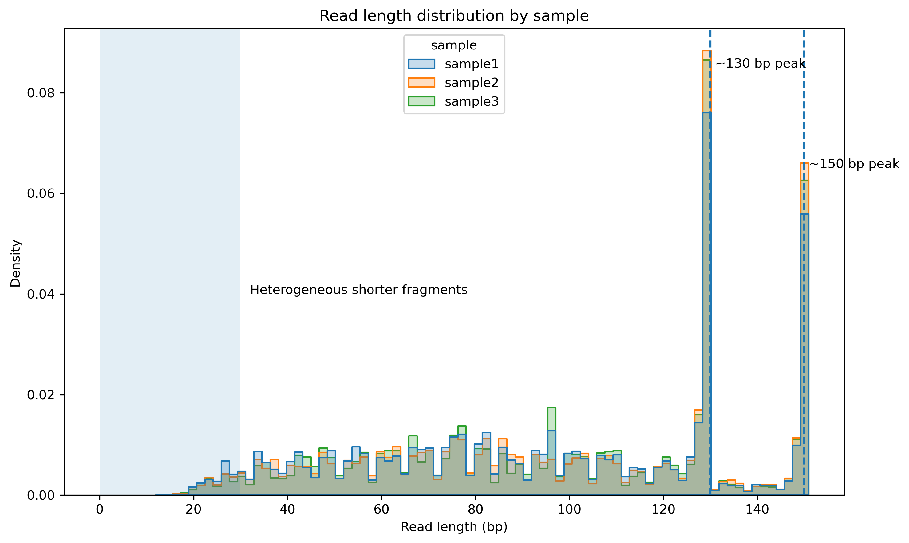

Read length distributions demonstrated reproducible enrichment peaks around ~130 bp and ~150 bp across samples, suggesting consistent fragment populations generated by the targeted assay.

## Mapping Quality Distributions

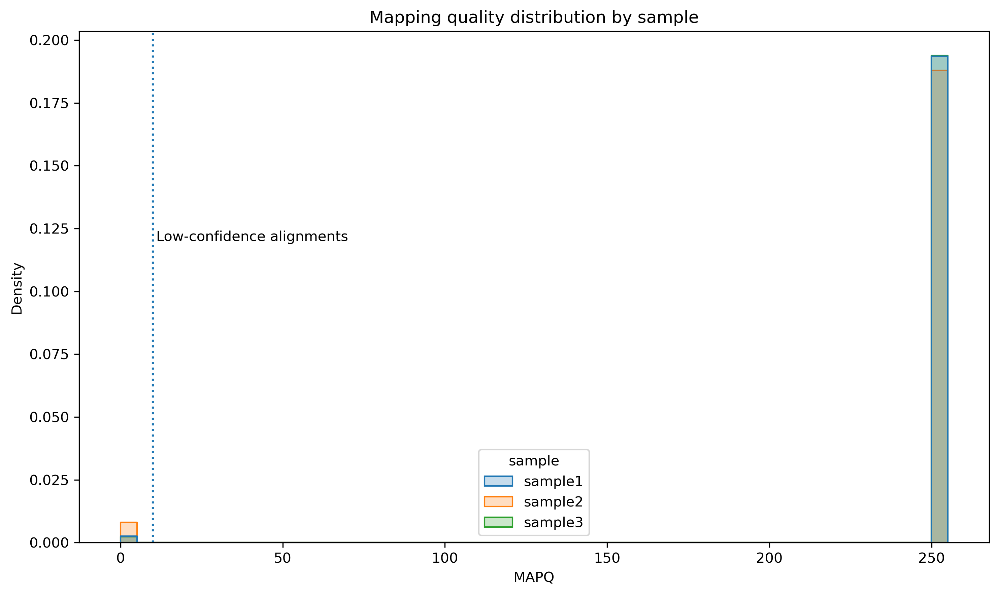

Most reads aligned with high confidence, while a minority of low-MAPQ alignments likely reflected repetitive or homologous sequence content.

## Barcode Complexity Analysis

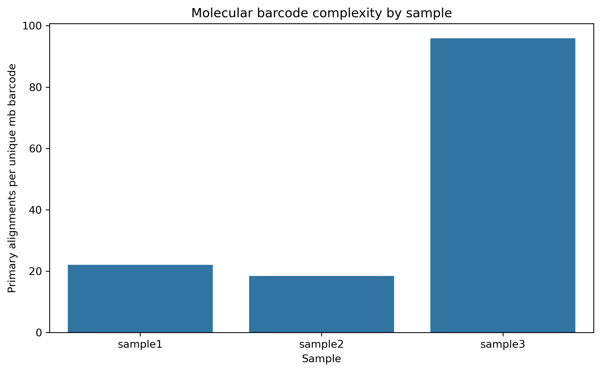

Molecule-aware deduplication revealed substantial differences between samples. sample3 demonstrated elevated reads-per-barcode ratios, suggesting reduced molecular complexity and increased amplification redundancy.

## QC Conclusions

Overall, the dataset demonstrated technically successful targeted enrichment behavior with strong alignment confidence and reproducible fragment structure. However, sample3 consistently exhibited:

- elevated amplification redundancy,
- reduced barcode complexity,
- and broader structural irregularities relative to samples 1 and 2.

---

# 2. Gene Enrichment and Molecule-Aware Deduplication

## Objectives

The enrichment analysis aimed to:

- identify recurrent targeted loci,
- quantify enrichment intensity,
- and evaluate the effect of barcode-aware deduplication.

## Region-Level Enrichment

Reads were aggregated into genomic bins and summarized using:

- raw read counts,
- and barcode-deduplicated molecule counts.

## Gene Annotation

Enriched regions were annotated using GENCODE v19.

Prominent enriched genes included:

- GNAS
- CCND1
- FGFR1
- AXL
- MET
- EGFR
- RAF1
- BRAF
- IDH2
- RAB7A

## Shared Enriched Regions

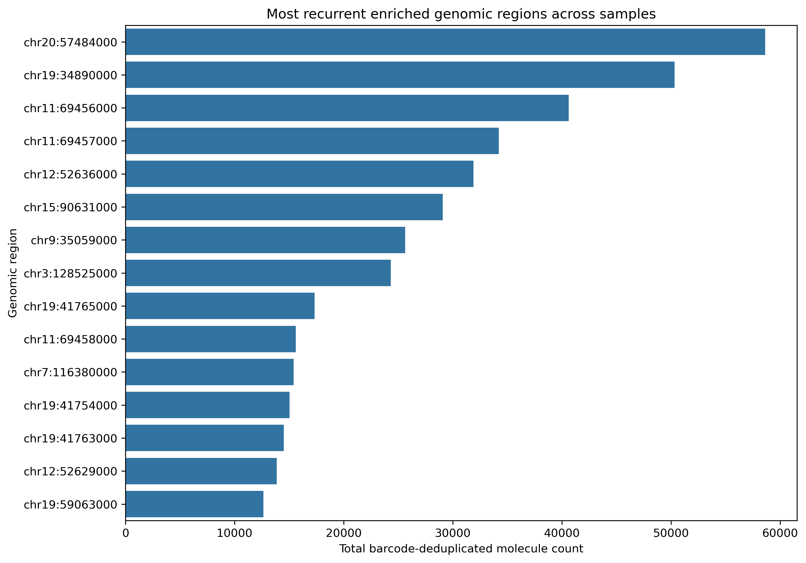

The targeted sequencing assay demonstrated strong enrichment at recurrent genomic loci shared across samples, with enrichment concentrated within a relatively small set of cancer-associated genes.

## Raw vs Barcode-Deduplicated Enrichment

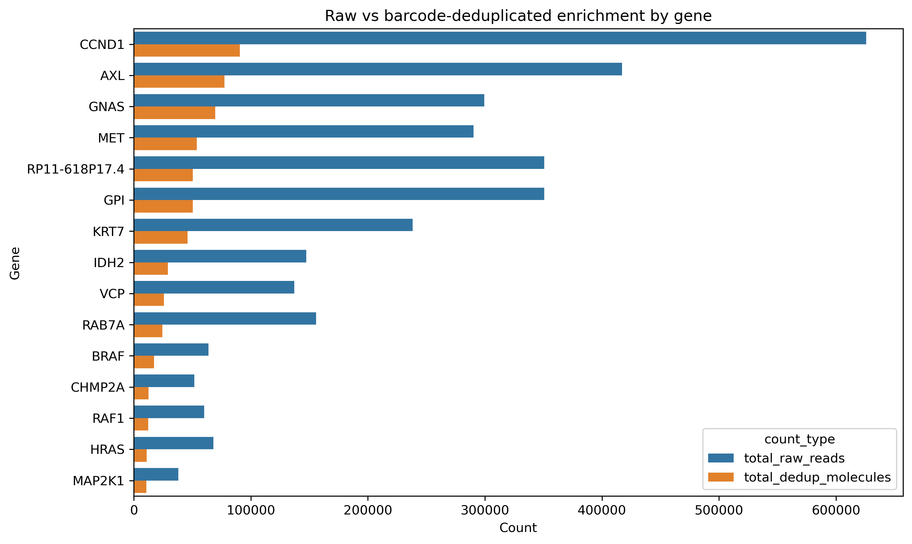

Barcode-aware deduplication substantially altered enrichment estimates within sample3, where many loci demonstrated extreme reads-per-molecule ratios.

## Sample-Specific Amplification Redundancy

### sample1

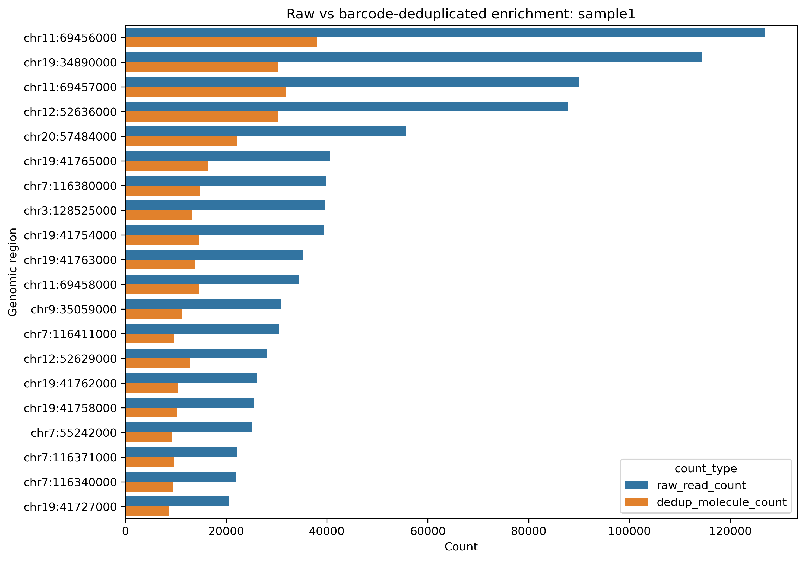

### sample2

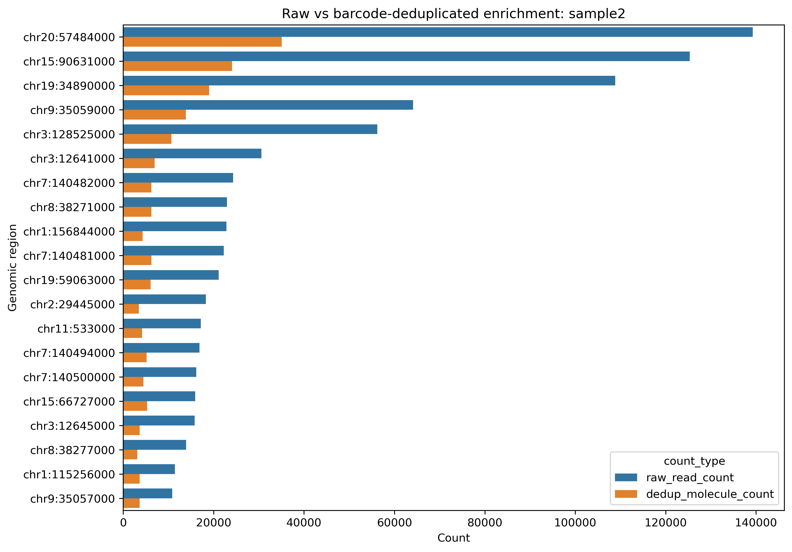

### sample3

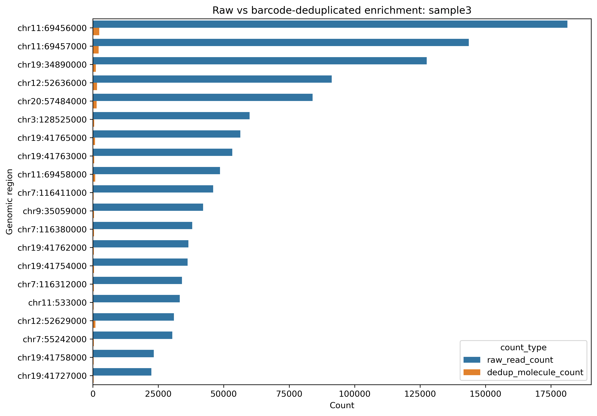

sample3 exhibited highly elevated amplification redundancy at several loci, with some regions exceeding >50–100 reads per molecule.

This suggests that raw sequencing depth substantially overestimated true molecular abundance within sample3.

## Enrichment Conclusions

The targeted assay successfully enriched a biologically coherent set of cancer-associated genes. Molecule-aware deduplication demonstrated that amplification bias strongly influenced apparent enrichment intensity, particularly in sample3.

---

# 3. Candidate Variant Analysis

## Objectives

Variant analysis aimed to identify candidate nucleotide substitutions and small indels within enriched target regions.

Because the dataset derives from RNA sequencing rather than matched DNA sequencing, all candidate variants were interpreted cautiously.

## Variant Calling Strategy

Variants were identified using:

- bcftools mpileup
- bcftools call

Variant calling was restricted to recurrent enriched target regions.

## Candidate Variant Burden

Filtered candidate variants were identified within multiple enriched genes including:

- FGFR1
- AXL
- RAF1
- EGFR
- MET
- CCND1
- RAB7A

## Candidate Variant Visualization

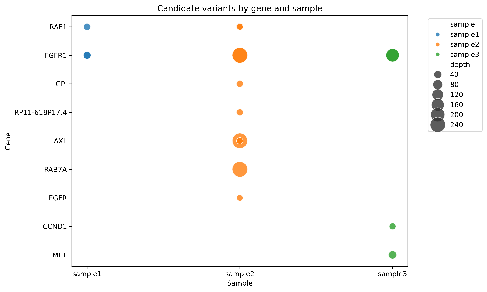

FGFR1 demonstrated recurrent high-confidence substitutions across all three samples.

sample2 demonstrated the broadest overall candidate variant burden, whereas sample3 showed fewer but still biologically relevant candidate events.

## Variant Interpretation

Several identified variants localized to genes with known oncogenic relevance, including receptor tyrosine kinases and MAPK-pathway-associated genes. However, because the data derive from targeted RNA sequencing, these findings should be interpreted as exploratory candidate observations rather than validated somatic mutations.

Potential confounding factors include:

- allele-specific expression,
- transcript abundance bias,
- RNA editing,
- reverse-transcription artifacts,
- and amplification redundancy.

## Variant Conclusions

The variant analysis identified multiple candidate variants localized to enriched targeted loci. However, because the data derive from targeted RNA sequencing, these events should be interpreted cautiously and would require orthogonal validation.

---

# 4. Soft-Clipped Read Analysis

## Objectives

Large soft-clipped reads (>15 bp) were investigated to determine whether they reflected:

- technical artifacts,
- repetitive sequence mapping,
- alignment ambiguity,
- or possible biologically meaningful transcript structures.

## Soft-Clipping Distributions

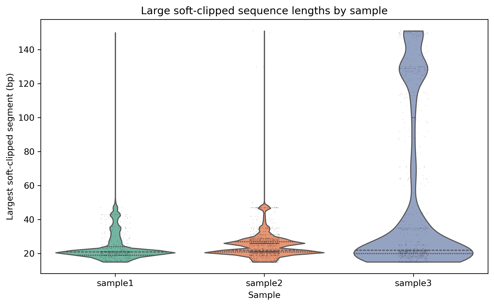

Samples 1 and 2 demonstrated relatively constrained soft-clipping distributions, whereas sample3 exhibited substantially broader clipping behavior extending beyond 100 bp.

Importantly, many soft-clipped reads retained high mapping quality scores, indicating that the aligned portions of these reads still mapped confidently to the reference genome.

## Recurrent Soft-Clipped Loci

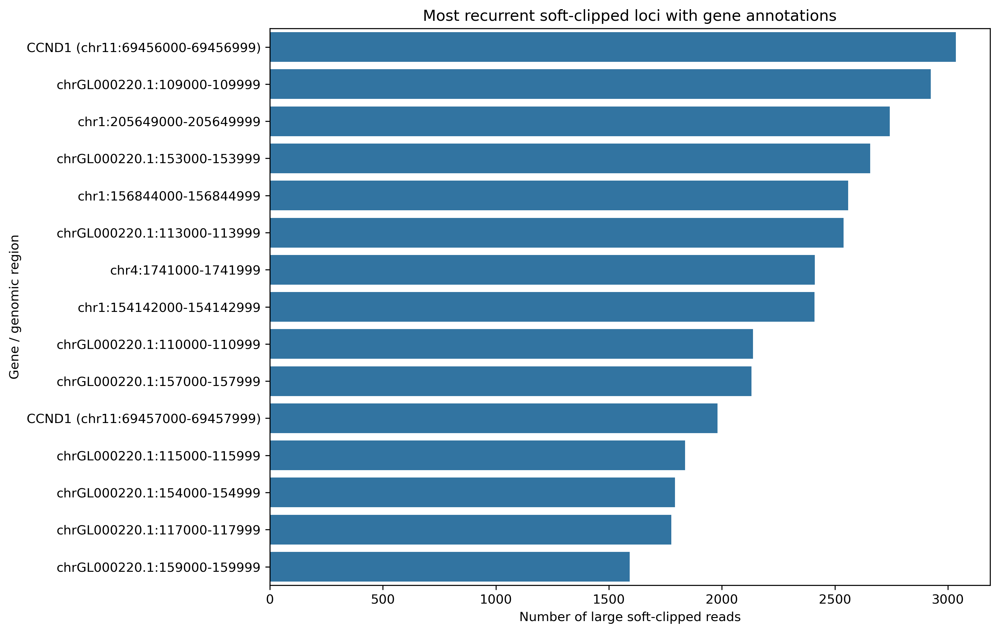

Soft clipping was strongly enriched at recurrent genomic loci rather than randomly distributed across the genome.

Particularly strong recurrence was observed around chr11:69456xxx–69457xxx, overlapping the highly enriched CCND1 locus identified during enrichment analysis.

This suggests that at least a subset of soft-clipped reads may reflect structurally complex transcript behavior or repetitive sequence architecture associated with enriched target regions.

## Remapping of Soft-Clipped Sequences

Soft-clipped sequences were extracted and independently remapped to hg19 using BWA-MEM.

Large numbers of clipped sequences remapped to:

- repetitive/unplaced contigs (`Un_gl000220`),
- multiple canonical chromosomes,
- and previously enriched target loci.

The strongest remapping enrichment occurred within `Un_gl000220`, suggesting that many clipped fragments likely originate from repetitive or ambiguously mappable sequence content.

Collectively, these findings support a mixture of:

- repetitive sequence mapping,
- homologous alignment ambiguity,
- off-target enrichment,
- and structurally complex RNA fragments.

No single dominant recurrent fusion-like event was identified.

## Soft-Clipping Conclusions

Soft-clipped reads were highly recurrent and biologically structured rather than randomly distributed sequencing artifacts. The data support a combination of repetitive sequence mapping and structurally complex transcript behavior associated with enriched targeted loci.

---

# Overall Conclusions

This analysis identified strong targeted enrichment across recurrent cancer-associated genomic loci including:

- CCND1
- FGFR1
- AXL
- MET
- EGFR
- RAF1
- BRAF
- GNAS
- IDH2
- and RAB7A

Molecule-aware barcode deduplication demonstrated that amplification redundancy substantially distorted raw read depth estimates in sample3, emphasizing the importance of barcode-aware quantification.

Variant analysis identified multiple recurrent and sample-specific candidate variants localized to enriched genes, although interpretation remains exploratory because the data derive from targeted RNA sequencing.

Soft-clipped read analysis demonstrated that large clipping events were highly recurrent and frequently associated with enriched loci and repetitive reference contigs rather than representing a single dominant fusion event.

Collectively, the dataset represents a technically successful targeted sequencing assay with biologically structured enrichment patterns, while also highlighting substantial sample-specific technical differences that should be considered during downstream interpretation.

---

# Reproducibility

The complete analysis workflow, notebooks, and reproducibility scripts are available within the accompanying GitHub repository.

Reference resources can be regenerated using:

```bash
bash scripts/download_and_index_references.sh
```